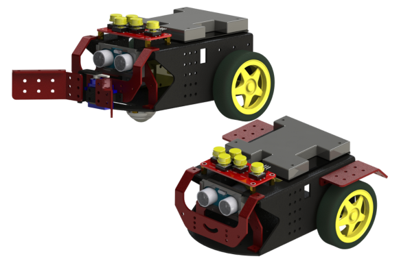

RENA-BOT Estándar
=================

El **RENA-BOT** es un robot educativo diseñado con un enfoque **compacto, modular y accesible**, orientado a la enseñanza de **STEM (Ciencia, Tecnología, Ingeniería y Matemáticas)** en niños y jóvenes de **5 a 14 años**.  
Su desarrollo busca apoyar tanto a la educación formal como a la educación extracurricular, ofreciendo una herramienta práctica para introducirse en el mundo de la robótica.

   RENA-Bot v1

**Propósito del RENA-BOT**
--------------------------

El RENA-BOT no es solo un kit de robótica, sino un programa integral que propone la integración de la robótica educativa como herramienta pedagógica para reforzar las destrezas y objetivos del currículo nacional del Ministerio de Educación del Ecuador, desde Preparatoria hasta el nivel Superior de Educación General Básica (EGB).  

El uso del robot móvil diferencial con sensores y actuadores permite que los estudiantes aprendan de manera activa, desarrollando pensamiento lógico, habilidades de resolución de problemas y trabajo colaborativo, mientras cumplen con los objetivos de aprendizaje establecidos por el Ministerio.  

**Características principales**
-------------------------------

- Diseño **compacto, modular y fácil de ensamblar**.  
- Compatibilidad con plataformas como **Arduino IDE**.  
- Conectividad WiFi.  
- Arquitectura basada en un robot móvil diferencial, con capacidad de expansión a nuevos sensores y actuadores.  
- Documentación y software educativo diseñados para acompañar el aprendizaje paso a paso.  

**Ámbitos de aplicación**
-------------------------

- **Educación formal:** implementación en instituciones educativas alineadas al currículo nacional.  
- **Educación no formal:** clubes de robótica, laboratorios de innovación y espacios maker.  
- **Uso individual:** estudiantes y familias que deseen explorar robótica y programación en casa.  

**Beneficios educativos**
-------------------------

El RENA-BOT fomenta:  

- El desarrollo del pensamiento computacional y la lógica algorítmica.  
- El aprendizaje basado en proyectos.  
- La creatividad y curiosidad tecnológica a través de la experimentación.  
- La colaboración y el trabajo en equipo en entornos de aprendizaje práctico.  

De esta manera, el RENA-BOT no solo introduce a los niños y jóvenes en la robótica, sino que también abre el camino hacia la investigación, la innovación y la preparación para los desafíos tecnológicos del futuro.  

.. note::
   Asegúrese de revisar las versiones de los diferentes paquetes disponibles, ya que cada componente cuenta con soporte específico en la documentación.
