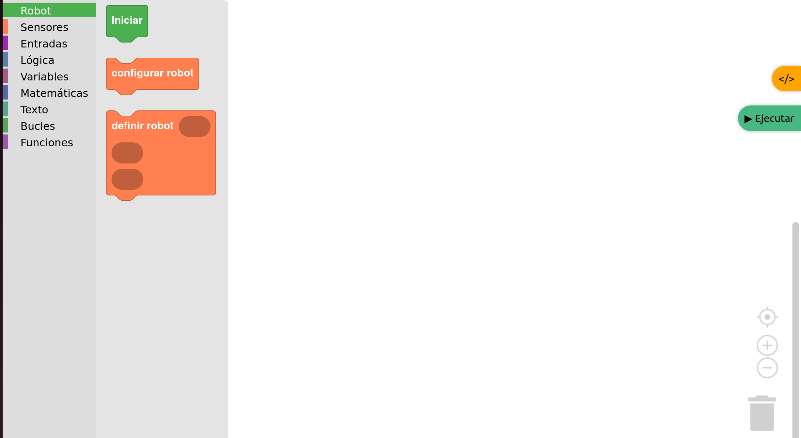
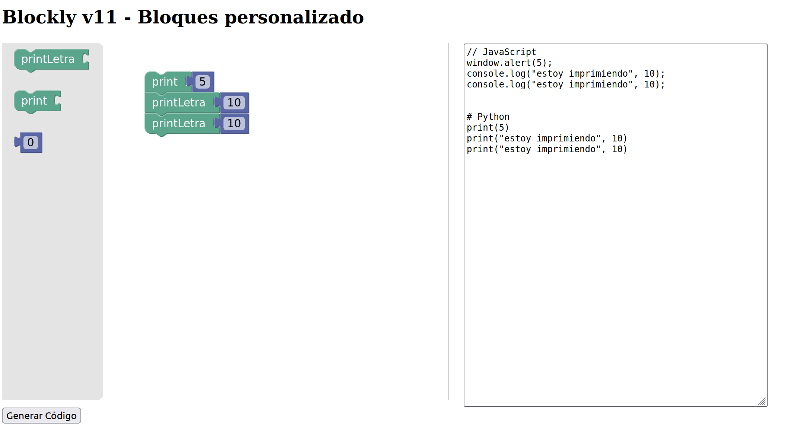

Blockly
=======

Blockly es un editor de programación visual desarrollado por Google que
utiliza bloques de arrastrar y soltar para representar conceptos de
código.

Es una biblioteca de JavaScript que permite a los desarrolladores
integrar un editor de código basado en bloques en sus aplicaciones.

Blockly es de código abierto y gratuito, y es la base de muchos
programas de aprendizaje de programación populares, como Scratch y
Code.org

Sobre la versión
----------------

La versión que se usa para este repositorio es blockly 11.X, esta
versión es la más estable actualmente y es ampliamente usado en
programas educativos.

`Repositorio
Oficial <https://developers.google.com/blockly/guides/create-custom-blocks/overview?hl=es-419>`__

`GitHub Google <https://github.com/google/blockly>`__

`Directorio de JS <https://app.unpkg.com/blockly@11.2.2>`__

**Formas de uso**

Al usar el directorio UNPKG, se puede acceder directamente a los
archivos compilados .js

De existir problemas con los archivos existentes en este directorio, se
debe clonar el repositorio GitHub y compilar.

Manejo del repositorio GitHub
~~~~~~~~~~~~~~~~~~~~~~~~~~~~~

1. Clonar el repositorio, con la versión 11.2:

.. code:: bash

   git clone https://github.com/google/blockly.git
   cd blockly

2. Instalar dependencias:

Instalación de Node.js

.. code:: bash

   curl -fsSL https://deb.nodesource.com/setup_18.x | sudo -E bash -
   sudo apt install -y nodejs

**Desinstalacion**

.. code:: bash

   sudo apt remove nodejs
   sudo rm -rf /etc/apt/sources.list.d/nodesource.list

Luego ejecuta:

.. code:: bash

   npm install

3. Construir (compilar) Blockly:

.. code:: bash

  npm run build

Esto genera la carpeta dist/ con:

.. code:: bash

   dist/
   ├── blockly.min.js
   ├── blockly_compressed.js
   ├── blocks_compressed.js
   ├── python_compressed.js
   ├── javascript_compressed.js
   └── msg/

4. Usarlo en el proyecto:

Copia los archivos que necesitas desde dist/ a tu carpeta js/ y
enlázalos en tu index.html como:

.. raw:: html

   

.. raw:: html

   

Ejemplos Básicos
----------------

Los siguientes index.html se usan como base para el uso de blockly en
diferentes escenarios.

.. tabs::

   .. group-tab:: 00_index.html

      .. [START codigo-00]

      Descripcion: Genera un código base para el uso de blockly, con el generador de código python y JavaScript.

      .. code-block:: html

         <!DOCTYPE html>
         <!--
         Avig Tech 2025
         Generador y ejecutor de bloques Blockly con salida JS + Python
         -->
         <html>
         <head>
         <meta charset="utf-8">
         <title>Blockly v11 - Generador y Ejecutar Código</title>

         <!-- Blockly y generadores -->
         
         
         

         
         </head>

         <body>
         <h2>Blockly v11 - Generar y Ejecutar</h2>

         

            

            <textarea id="codeArea" readonly></textarea>
         

         

            <button onclick="generarCodigo()">Generar Código</button>
            <button onclick="ejecutarCodigo()">Ejecutar JS</button>
         

         
         </body>
         </html>

      .. [END codigo-00]

   .. group-tab:: 01_index.html

      .. [START codigo-01]

      Descripcion: Ejecuta el codigo generado por blockly

      .. code-block:: html

         <!DOCTYPE html>
         <!--
         Avig Tech 2025
         Generador y ejecutor de bloques Blockly con salida JS + Python
         -->
         <html>
         <head>
         <meta charset="utf-8">
         <title>Blockly v11 - Generador y Ejecutar Código</title>

         <!-- Blockly y generadores -->
         
         
         

         
         </head>

         <body>
         <h2>Blockly v11 - Generar y Ejecutar</h2>

         

            

            <textarea id="codeArea" readonly></textarea>
         

         

            <button onclick="generarCodigo()">Generar Código</button>
            <button onclick="ejecutarCodigo()">Ejecutar JS</button>
         

         
         </body>
         </html>
 
      .. [END codigo-01]

Resultado obtenido: |alt text|

Estilo personalizado
~~~~~~~~~~~~~~~~~~~~

Se puede personlizar el estilo de los bloques y categorías usando
``Blockly.Theme.defineTheme`` .

Esto permite tener: 

- Bloques más estilizados y modernos. 

- Colores personalizados para categorías. 

- Bordes suaves, fuente clara, etc.

Paso a añadir al script JavaScript

Agrega esto justo antes de Blockly.inject(…) :

.. code-block:: html

   // 1. Definir un tema personalizado con colores, bordes y fuente
   const miTemaClaro = Blockly.Theme.defineTheme('miTemaClaro', {
     base: Blockly.Themes.Classic,  // Puedes usar 'Classic', 'Modern', etc.
     blockStyles: {
       colour_blocks: {
         colourPrimary: '#4caf50',
         colourSecondary: '#388e3c',
         colourTertiary: '#2e7d32'
       },
       logic_blocks: {
         colourPrimary: '#ff9800'
       },
       loop_blocks: {
         colourPrimary: '#03a9f4'
       },
       text_blocks: {
         colourPrimary: '#9c27b0'
       }
     },
     categoryStyles: {
       dashboard_category: {
         colour: '#4caf50'
       }
     },
     componentStyles: {
       workspaceBackgroundColour: '#f3f6fa',
       toolboxBackgroundColour: '#e0e0e0',
       toolboxForegroundColour: '#333',
       flyoutBackgroundColour: '#ffffff',
       flyoutOpacity: 1,
       scrollbarColour: '#888'
     },
     fontStyle: {
       family: 'Verdana, sans-serif',
       weight: 'normal',
       size: 14
     },
     startHats: false
   });

Y luego modificar el ``Blockly.inject(...)`` así:

.. code-block:: html

   const workspace = Blockly.inject('blocklyDiv', {
     toolbox: document.getElementById('toolbox'),
     theme: miTemaClaro,
     scrollbars: true,
     trashcan: true,
     zoom: { controls: true },
     renderer: "zelos",
     sounds: false
   });

Blockly + websocket y Excel
~~~~~~~~~~~~~~~~~~~~~~~~~~~

.. code::
   
   pip install pandas websocket

versiones de librerías python instaladas:

.. list-table::
   :header-rows: 1
   :widths: 15 15

   * - libreria 
     - version
   * - Numpy
     - 2.2.6
   * - pandas
     - 2.3.1
   * - Websocket
     - 0.2.1
   * - pip install openpyxl
     - 3.1.5

Para utilizar un archivo de configuracion de excel para los diferentes bloques a utilizarse, se
debe seguir los siguientes pasos:

1. Generar un archivo excel que contenga la siguiente informacion:

.. list-table::
   :header-rows: 1
   :widths: 15 15

   * - Atributo 
     - Uso
   * - categoria
     - Categoria visual
   * - nombre_categoria
     - Nombre de la categoria para blockly
   * - tipo_bloque
     - Tipo de bloque
   * - hat
     - Es un bloque de inicio si/no
   * - mensaje0
     - Mensaje que se muestra en el bloque
   * - color
     - Definicion de colores
   * - inputs
     - Entradas del bloque
   * - tooltip
     - Mensaje de ayuda
   * - codigo_python
     - Codigo python que contiene el bloque 

.. note::
   Si el bloque es de cabezera eliminar el argumento ``"previousStatement": null`` el archivo
   ``02_bloques.js`` generado

2. Ejecutar el archivo ``02_xlxs_tojs.py``

3. Ejecutar el código  ``02_main.py``

4. Ejecutar el código  ``02_index.html``

**Códigos**

- **Código base** ``02_xlxs_tojs.py``: Transforma la información generada de los bloques de un archivo .xlxs a un archivo .js

- **Código base** ``02_main.py``: Habilita un puerto de comunicación para recibir el código generado  por blockly, posteriormente ejecuta el código como un subproceso de python.

- **Código base** ``02_index.html``: Carga la información de los bloques personalizados, genera el código en python y luego envia ese código usando websocket para que sea ejecutado en segundo plano. No se puede leer la información en forma de retroalimentación en tiempo real.

.. tabs::

   .. group-tab:: 02_xlxs_tojs4

      .. [START codigo-02-1]

      Descripción: Transforma la información generada de los bloques de un archivo .xlxs a un archivo .js

      .. code-block:: python 

         """
         Avig Tech 2025

         Descripción:

         Lee un archivo .xlsx que contiene la información de cada bloque a un archivo de 
         informacion .js
         """

         import pandas as pd
         import json

         df = pd.read_excel("02_bloques.xlsx")
         bloques = {}
         python_gen = {}

         for _, row in df.iterrows():
            cat = row["categoria"]
            if cat not in bloques:
               bloques[cat] = {
                     "nombre": row["nombre_categoria"],
                     "color": row["color"],
                     "bloques": []
               }

            args = []
            for i in range(int(row.get("inputs", 0))):
               args.append({
                     "type": "input_value",
                     "name": f"INPUT{i+1}"
               })

            bloque = {
               "type": row["tipo_bloque"],
               "message0": row["mensaje0"],
               "args0": args,
               "previousStatement": None,
               "nextStatement": None,
               "colour": row["color"],
               "tooltip": row["tooltip"],
               "hat": None if row["hat"] == "no_aplica" else row["hat"],
            }
            bloques[cat]["bloques"].append(bloque)

            # Python Generator Handling
            python_gen[row["tipo_bloque"]] = row["codigo_python"]

         contenido_js = f"window.bloquesPersonalizados = {json.dumps({'categorias': bloques, 'python': python_gen}, indent=2)};"

         with open("02_bloques.js", "w", encoding="utf-8") as f:
            f.write(contenido_js)

         print("✅ Archivo bloques.js generado correctamente.")

      .. [END codigo-02-1]

   .. group-tab:: 02_bloques

      .. [START codigo-02-2]

      Descripción: Ejemplo de los blqoues generados 

      .. code-block:: html

         window.bloquesPersonalizados = {
         "categorias": {
            "robot": {
               "nombre": "Robot",
               "color": "#4caf50",
               "bloques": [
               {
                  "type": "conf_pkg",
                  "message0": "Iniciar ",
                  "args0": [],
                  "nextStatement": null,
                  "colour": "#4caf50",
                  "tooltip": "Agrega paquetes python",
                  "hat": "cap"
               },
               {
                  "type": "conf_globales",
                  "message0": "configurar robot",
                  "args0": [],
                  "previousStatement": null,
                  "nextStatement": null,
                  "colour": "#ff7f50",
                  "tooltip": "variables globales",
                  "hat": null
               },
               {
                  "type": "conf_robot",
                  "message0": "definir robot %1 %2 %3",
                  "args0": [
                     {
                     "type": "input_value",
                     "name": "INPUT1"
                     },
                     {
                     "type": "input_value",
                     "name": "INPUT2"
                     },
                     {
                     "type": "input_value",
                     "name": "INPUT3"
                     }
                  ],
                  "previousStatement": null,
                  "nextStatement": null,
                  "colour": "#ff7f50",
                  "tooltip": "nombres del robot",
                  "hat": null
               }
               ]
            },
            "sensores": {
               "nombre": "Sensores",
               "color": "#ff7f50",
               "bloques": [
               {
                  "type": "def_sensor",
                  "message0": "actualizar datos del sensor",
                  "args0": [],
                  "previousStatement": null,
                  "nextStatement": null,
                  "colour": "#ff7f50",
                  "tooltip": "actualiza los datos del sensor",
                  "hat": null
               }
               ]
            }
         },
         "python": {
            "conf_pkg": "# carga de paquetes\nimport time\nimport json\nimport paho.mqtt.client as mqtt\nprint(2)",
            "conf_globales": "nombre_robot = \"rm1\"\ncamino = []\nestado_recibido = None\nsensores = []",
            "conf_robot": "v1 = {i1}\nv2 = {i2}\nV3 = {i3}",
            "def_sensor": "Dato = 0.25"
         }
         };
 

      .. [END codigo-02-2]

   .. group-tab:: 02_main

      .. [START codigo-02-3]

      Descripción: Habilita un puerto de comunicación para recibir el código generado  por blockly, posteriormente ejecuta el código como un subproceso de python.

      .. code-block:: python

         """
         Avig Tech - Versión simplificada

         Descripción:
         Este script lanza un servidor WebSocket en `ws://localhost:5678`
         y espera recibir código Python desde un cliente (por ejemplo, una interfaz Blockly).
         Cuando recibe una acción "ejecutar_python", ejecuta ese código en un proceso separado.
         """

         import asyncio
         import multiprocessing
         import json

         try:
            import websockets
         except ImportError:
            websockets = None
            print("Módulo websockets no instalado. Instálalo con: pip install websockets")

         # Variable global para controlar el proceso en ejecución
         proceso_codigo = None

         # Función que ejecuta el código Python recibido
         def ejecutar_codigo(codigo):
            try:
               exec(codigo, {})
            except Exception as e:
               print(f"Error ejecutando código:\n{e}")

         # Función manejadora de WebSocket
         async def ws_handler(websocket):
            global proceso_codigo
            print("Cliente conectado")

            try:
               async for message in websocket:
                     print(f"Mensaje recibido: {message}")

                     try:
                        data = json.loads(message)
                     except Exception as err:
                        print("No se pudo decodificar el mensaje:", err)
                        continue

                     if data.get("accion") == "ejecutar_python":
                        codigo = data.get("codigo", "")

                        # Si hay un proceso corriendo, lo detenemos primero
                        if proceso_codigo is not None and proceso_codigo.is_alive():
                           proceso_codigo.terminate()
                           proceso_codigo.join()

                        # Creamos un nuevo proceso para ejecutar el nuevo código
                        proceso_codigo = multiprocessing.Process(target=ejecutar_codigo, args=(codigo,))
                        proceso_codigo.start()

                        # Enviar confirmación al cliente
                        respuesta = {"accion": "resultado", "output": "Código ejecutándose..."}
                        await websocket.send(json.dumps(respuesta))

                     elif data.get("accion") == "detener_codigo":
                        if proceso_codigo is not None and proceso_codigo.is_alive():
                           proceso_codigo.terminate()
                           proceso_codigo.join()
                           proceso_codigo = None
                           respuesta = {"accion": "resultado", "output": "Código detenido."}
                        else:
                           respuesta = {"accion": "resultado", "output": "No hay código ejecutándose."}

                        await websocket.send(json.dumps(respuesta))

            except Exception as e:
               print("Error en WebSocket:", e)

         # Servidor WebSocket
         async def ws_server():
            print("Iniciando servidor WebSocket en ws://localhost:5678")
            async with websockets.serve(ws_handler, "localhost", 5678):
               await asyncio.Future()  # Mantiene el servidor corriendo

         # Punto de entrada
         if __name__ == "__main__":
            if websockets is None:
               print("Instala la librería con: pip install websockets")
            else:
               asyncio.run(ws_server())

      .. [END codigo-02-3]

   .. group-tab:: 02_index

      .. [START codigo-02-4]

      Descripción: Carga la información de los bloques personalizados, genera el código en python y luego envia ese código usando websocket para que sea ejecutado en segundo plano. No se puede leer la información en forma de retroalimentación en tiempo real.

      .. code-block:: html

         <!DOCTYPE html>
         <html>
         <head>
         <meta charset="utf-8">
         <title>Avig Tech Blockly Básico</title>

         <!-- Librerías -->
         
         
         
         

         <!-- Estilos -->
         
         </head>
         <body>
         

            

            <!-- Botones flotantes -->
            <button id="toggleCodeBtn">&lt;/&gt;</button>
            <button id="executeBtn" onclick="ejecutarCodigoPython()">▶ Ejecutar</button>

            <!-- Panel lateral de código -->
            

               <button id="closeCodeBtn">X</button>
               <textarea id="codeArea" readonly></textarea>
            

         

         <!-- Toolbox dinámico -->
         <xml id="toolbox" style="display: none"></xml>

         
         </body>
         </html>

      .. [END codigo-02-4]

El resultado esperado es el siguiente:
|bloques per|

Blockly + WebSocket
~~~~~~~~~~~~~~~~~~~

El siguiente código genera un diccionario que es enviado por WebSocket, se utiliza el puerto 81 para el
envio de mensajes.

.. tabs:: 

   .. group-tab:: Blockly.index

      .. [START codigo-03-1]

      Descripción: Index de blockly para la generacion de bloques personalizados con websocket.

      .. code-block:: html

         <!DOCTYPE html>
         <html>
         <head>
         <meta charset="utf-8">
         <title>AVIG TECH - RENA BOT</title>
         
         
           <!-- Libreria personalizada -->

         
         </head>

         <body>

         <!-- BARRA SUPERIOR -->
         

            AVIG TECH | Blockly
            

               <button class="dropbtn">⚙️ Opciones</button>
               

               <a href="#" onclick="guardarWorkspace()">💾 Guardar bloques</a>
               <a href="#" onclick="document.getElementById('inputArchivo').click()">📥 Cargar bloques</a>
               

            

            <input type="file" id="inputArchivo" accept=".xml" style="display:none" onchange="cargarWorkspace(event)">
         

         

            

            

               <textarea id="codeArea" readonly></textarea>
            

            <!-- Botones Código -->
            <button id="toggleCodeBtn">Código</button>
            <button id="runBtn">▶️</button>
            <!-- Botones Sensores -->
            <button id="togglegraficarBtn">Sensores</button>
            <button id="graficarBtn">▶️</button>

            

               <button id="modoMoverBtn" style="margin-bottom: 10px; width: fit-content;">🖱️ Modo mover</button>
            

         

         <!-- TOOLBOX DEFINIDO -->
         <xml id="toolbox" style="display: none">
            <category name="Rena 1" colour="#f19f10">
               <block type="bloque_inicar"></block>
               <block type="modo_rena"></block>
               <block type="bloque_velocidad"></block>
               <block type="avance_libre"></block>
               <block type="giro_libre"></block>
               <block type="bloque_gripper"></block>
               <block type="bloque_esperar"></block>
               <block type="bloque_led"></block>
            
            </category>

            <category name="Sensores" colour="#f19f10">
               <block type="bloque_leer_sensor"></block>
               <block type="get_sensor"></block>
            </category>

            <category name="Valores" colour="#2777c3">
               <block type="math_number"></block>
               <block type="text"></block>
               <block type="logic_boolean"></block>
            </category>

            <category name="Control" colour="#2fa92f">
               <block type="bloque_if"></block>
               <block type="bloque_for"></block>
               <block type="bloque_if_else"></block>
            </category>

            <category name="Lógica" colour="#2196f3">
               <block type="logic_compare"></block>
               <block type="logic_operation"></block>
               <block type="logic_boolean"></block>
            </category>

            <!--
            <category name="Variables" colour="#ba68c8">
               <block type="crear_variable"></block>
               <block type="set_variable"></block>
               <block type="get_variable"></block>
            </category> -->
         </xml>

         

         

         </body>
         </html>
      
      .. [END codigo-03-1]
   
   .. group-tab:: bloques.js

      .. [START codigo-03-2]

      Descripción: Lista de bloques y algoritmos para la generacion de bloques.

      .. code-block:: html

         // Geneneración de bloques 

         Blockly.defineBlocksWithJsonArray([

         // -------------------- Bloques Principales ----------------------------------  
               // Bloque Iniciar el Robot
            {
               "type": "bloque_inicar",
               "message0": "Iniciar kit de robótica %1 IP del servidor %2",
               "args0": [
                     { "type": "field_input", "name": "NOMBRE", "text": "Rena1" },
                     { "type": "field_input", "name": "IP", "text": "192.168.100.184" }
                  ],
               "hat": "cap",
               "nextStatement": null,
               "colour": "#f19f10",
               "tooltip": "Iniciar Rena Robot"
            },

            // Bloque movimiento RENA en malla
            {
               "type": "modo_rena",
               "message0": "Mover Robot Movil %1",
               "args0": [
                           {
                           "type": "field_dropdown",
                           "name": "MOV",
                           "options": [
                                 ["adelante", "0"],
                                 ["izquierda", "1"],
                                 ["derecha", "2"],
                                 ["atras", "3"]
                           ]
                           },
                           ],
               "previousStatement": null,
               "nextStatement": null,
               "colour": 230,
               "tooltip": "Activa los movimientos del RENA en la malla"
            },
            
            // Avance Libre
            {
               "type": "avance_libre",
               "message0": "Modo libre %1 durate %2 segundos",
               "args0": [
                           {
                           "type": "field_dropdown",
                           "name": "VALOR",
                           "options": [
                                 ["adelante", "0"],
                                 ["retroceder", "1"]
                           ]
                           },
                           { "type": "input_value", "name": "TIME", "check": "Number" },
                           ],
               "previousStatement": null,
               "nextStatement": null,
               "colour": 230,
               "tooltip": "Controla el avance del RENA Bot durante x segundos"
            }, 

            //  Giro libre
            {
               "type": "giro_libre",
               "message0": "Modo libre %1 durate %2 segundos",
               "args0": [
                           {
                           "type": "field_dropdown",
                           "name": "VALOR",
                           "options": [
                                 ["giro izquierda", "0"],
                                 ["giro derecha", "1"]
                           ]
                           },
                           { "type": "input_value", "name": "TIME", "check": "Number" },
                           ],
               "previousStatement": null,
               "nextStatement": null,
               "colour": 230,
               "tooltip": "Controla el giro del RENA Bot durante x segundos"
            },

            // Bloque Esperar 
            {
               "type": "bloque_esperar",
               "message0": "Esperar  %1 segundos",
                  "args0": [
                     { "type": "input_value", "name": "TIME", "check": "Number" },
                           ],
               "previousStatement": null,
               "nextStatement": null,
               "colour": 230,
               "tooltip": "Espera una cantidad de tiempo"
            },

            // Bloque modificar velocidad 
            {
               "type": "bloque_velocidad",
               "message0": "Velocidad %1 porcentaje",
               "args0": [
                        { "type": "input_value", "name": "VELOCIDAD", "check": "Number" }
                        ],
               "previousStatement": null,
               "nextStatement": null,
               "colour": 230,
               "tooltip": "Define la velocidad a la que se mueve el robot"
            },

            // Bloque activar el gripper
            {
               "type": "bloque_gripper",
               "message0": "Gripper %1",
               "args0": [
                     {
                     "type": "field_dropdown",
                     "name": "GRIPPER",
                     "options": [
                        ["Abrir", "1"],
                        ["Cerrar", "0"],
                     ]
                     },
                        ],
               "previousStatement": null,
               "nextStatement": null,
               "colour": 230,
               "tooltip": "Cambiar el estado del gripper"
            },

            // Bloque Encender LEDs
            {
               "type": "bloque_led",
               "message0": "LED %1",
               "args0": [
                     {
                     "type": "field_dropdown",
                     "name": "LED",
                     "options": [
                        ["ON", "1"],
                        ["OFF", "0"],
                     ]
                     },
                        ],
               "previousStatement": null,
               "nextStatement": null,
               "colour": 230,
               "tooltip": "Encender LEDS"
            },
            
            //  ------------------------------ Bloque condicionales -------------------
            // Bloque condicional IF
            {
               "type": "bloque_if",
               "message0": "si %1 entonces %2",
               "args0": [
                     {
                     "type": "input_value",
                     "name": "VAR",  // recibe expresiones booleanas como output: "Boolean"
                     "check": "Boolean"
                     },
                     {
                     "type": "input_statement",
                     "name": "ENTONCES"
                     }
               ],
               "colour": 120,
               "tooltip": "Evalúa una condición lógica y ejecuta si se cumple",
               "previousStatement": null,
               "nextStatement": null
            },

            // Bloque For
            {
               "type": "bloque_for",
               "message0": "repetir %1 veces %2 hacer %3",
               "args0": [
                     { "type": "input_value", "name": "VECES", "check": "Number" },
                     { "type": "input_dummy" },
                     { "type": "input_statement", "name": "HACER" }
               ],
               "colour":120,
               "tooltip": "Repite instrucciones varias veces",
               "previousStatement": null,
               "nextStatement": null
            },

            // BLoque Comparación entre variables 
            {
               "type": "logic_compare",
               "message0": "%1 %2 %3",
               "args0": [
               { "type": "input_value", "name": "A", "check": "Number" },
               {
                     "type": "field_dropdown",
                     "name": "OP",
                     "options": [
                     ["=", "=="],
                     ["≠", "!="],
                     ["<", "<"],
                     ["≤", "<="],
                     [">", ">"],
                     ["≥", ">="]
                     ]
               },
               { "type": "input_value", "name": "B", "check": "Number" }
               ],
               "inputsInline": true,
               "output": "Boolean",
               "colour": 210,
               "tooltip": "Compara dos valores numéricos"
            },

            // Bloque condicional entre IFs
            {
               "type": "logic_operation",
               "message0": "%1 %2 %3",
               "args0": [
               {
                     "type": "input_value",
                     "name": "A",
                     "check": "Boolean"
               },
               {
                     "type": "field_dropdown",
                     "name": "OP",
                     "options": [["y", "AND"], ["o", "OR"]]
               },
               {
                     "type": "input_value",
                     "name": "B",
                     "check": "Boolean"
               }
               ],
               "inputsInline": true,
               "output": "Boolean",
               "colour": 210,
               "tooltip": "Operador lógico AND/OR"
            },
            
            // Bloque If/Else
            {
               "type": "bloque_if_else",
               "message0": "si %1 entonces %2 si no %3",
               "args0": [
               { "type": "input_value", "name": "COND", "check": "Boolean" },
               { "type": "input_statement", "name": "ENTONCES" },
               { "type": "input_statement", "name": "SINO" }
               ],
               "previousStatement": null,
               "nextStatement": null,
               "colour": 120,
               "tooltip": "Si la condición se cumple, hace algo; si no, otra cosa."
            },

            // Bloque Booleano
            {
               "type": "logic_boolean",
               "message0": "%1",
               "args0": [
               {
                     "type": "field_dropdown",
                     "name": "BOOL",
                     "options": [["verdadero", "True"], ["falso", "False"]]
               }
               ],
               "output": "Boolean",
               "colour": 210,
               "tooltip": "Devuelve verdadero o falso"
            },

            // ------------------------------ Bloques de variables propias --------------
            // Bloque crear variable
            {
            "type": "crear_variable",
            "message0": "crear variable %1 con valor %2",
            "args0": [
               { "type": "field_input", "name": "NOMBRE", "text": "mi_variable" },
               { "type": "input_value", "name": "VALOR" }
            ],
            "previousStatement": null,
            "nextStatement": null,
            "colour": 290,
            "tooltip": "Crea una nueva variable con valor inicial"
            },

            //  BLoque modificar variables
            {
            "type": "set_variable",
            "message0": "establecer %1 a %2",
            "args0": [
               { "type": "field_input", "name": "NOMBRE", "text": "mi_variable" },
               { "type": "input_value", "name": "VALOR" }
            ],
            "previousStatement": null,
            "nextStatement": null,
            "colour": 290,
            "tooltip": "Asigna un nuevo valor a una variable"
            },

            // Bloque Obtener variable
            {
            "type": "get_variable",
            "message0": "valor de %1",
            "args0": [
               { "type": "field_input", "name": "NOMBRE", "text": "mi_variable" }
            ],
            "output": null,
            "colour": 290,
            "tooltip": "Obtiene el valor actual de la variable"
            },

            // ---------------------------Bloques de sensores-----------------------
            // Bloque leer dato del sensor
            {
            "type": "bloque_leer_sensor",
            "message0": "Leer el sensor %1",
            "args0": [
                     {
                     "type": "field_dropdown",
                     "name": "SENSOR",
                     "options": [
                        ["ultrasonico", "ultrasonico"],
                        ["LDR", "LDR"],
                     ]
                     },
            ],
            "previousStatement": null,
            "nextStatement": null,
            "colour": 290,
            "tooltip": "Actualiza el valor de un sensor"
            },

            // Variable de sensor
            {
            "type": "get_sensor",
            "message0": "sensor %1",
            "args0": [
               {
               "type": "field_input",
               "name": "NUM",
               "text": "ultrasonico"
               }
            ],
            "output": "Number",  // o "String" si es texto, o null si es genérico
            "colour": 290,
            "tooltip": "Devuelve el nombre de la variable para usar en comparaciones"
         }
            ]);

         // Generadores de bloques 

            const jsonGen = new Blockly.Generator("JSON");
            jsonGen.ORDER_ATOMIC = 0;

            jsonGen.init = function(workspace) {
               jsonGen.commands_ = [];
            };

            jsonGen.scrub_ = function(block, code) {
               const next = block.getNextBlock();
               if (next) jsonGen.blockToCode(next);
               return block.outputConnection ? code : "";
            };

         //  -------------------------------------- GENERACION DE BLOQUES ----------------------
         
         // ---------------------------------------- Bloques principales -----------------------
         // Generador bloque iniciar
            jsonGen.forBlock['bloque_inicar'] = function(block) {
               const nombre = block.getFieldValue("NOMBRE");
               const ip = block.getFieldValue("IP");
               jsonGen.ip = ip;  // <-- Guardamos la IP para uso global
               jsonGen.commands_.push({
               accion: "iniciar",
               mensaje: {nombre},
               ip
               });
               return '';
            };

         // Movimientos del RENA en malla 
            jsonGen.forBlock['modo_rena'] = function(block) {
               const valor = block.getFieldValue("MOV");
               jsonGen.commands_.push({
               accion: "modo_rena",
               mensaje: { valor }
               });
               return '';
            };
         
         // Generador bloque de Avance libre
            jsonGen.forBlock['avance_libre'] = function(block) {
            const valor = block.getFieldValue("VALOR");

            let timer = 0;
            const b = block.getInputTargetBlock("TIME");
            if (b && b.type === 'math_number') {
               const raw = b.getFieldValue('NUM');
               const num = parseFloat(raw);
               if (!isNaN(num)) {
               // Redondear a máximo 3 decimales
               timer = Math.round(num * 1000) / 1000;

               // Asegurar que tenga al menos 1 decimal (por ejemplo 2 → 2.0)
               if (Number.isInteger(timer)) {
                  timer = timer.toFixed(1);
               }
               }
            }

            jsonGen.commands_.push({
               accion: "avance_libre",
               mensaje: { valor, timer }
            });
            return '';
            };
         
         // Generador bloque giro libre
            jsonGen.forBlock['giro_libre'] = function(block) {
            const valor = block.getFieldValue("VALOR");

            let timer = 0;
            const b = block.getInputTargetBlock("TIME");
            if (b && b.type === 'math_number') {
               const raw = b.getFieldValue('NUM');
               const num = parseFloat(raw);
               if (!isNaN(num)) {
               // Redondear a máximo 3 decimales
               timer = Math.round(num * 1000) / 1000;

               // Asegurar que tenga al menos 1 decimal (por ejemplo 2 → 2.0)
               if (Number.isInteger(timer)) {
                  timer = timer.toFixed(1);
               }
               }
            }

            jsonGen.commands_.push({
               accion: "giro_libre",
               mensaje: { valor, timer }
            });
            return '';
            };

         // Generador bloque de LED
            jsonGen.forBlock['bloque_led'] = function(block) {
               const valor = block.getFieldValue("LED");
               jsonGen.commands_.push({
               accion: "LED",
               mensaje: { valor }
               });
               return '';
            };

         //  Generador bloque Esperar
            jsonGen.forBlock['bloque_esperar'] = function(block) {

            let timer = 0;
            const b = block.getInputTargetBlock("TIME");
            if (b && b.type === 'math_number') {
               const raw = b.getFieldValue('NUM');
               const num = parseFloat(raw);
               if (!isNaN(num)) {
               // Redondear a máximo 3 decimales
               timer = Math.round(num * 1000) / 1000;

               // Asegurar que tenga al menos 1 decimal (por ejemplo 2 → 2.0)
               if (Number.isInteger(timer)) {
                  timer = timer.toFixed(1);
               }
               }
            }
            
            jsonGen.commands_.push({ 
               accion: "esperar",
               mensaje: {timer}
               });
               return '';
            };

         // Generador bloque velocidad 
            jsonGen.forBlock['bloque_velocidad'] = function(block) {
               let porcentaje = 60;
               const b = block.getInputTargetBlock("VELOCIDAD");
               if (b && b.type === 'math_number') porcentaje = parseInt(b.getFieldValue('NUM')) || 60;

               jsonGen.commands_.push({
               accion: "set_velocidad",
               mensaje: { porcentaje }
               });
               return '';
            };

         // Generador gripper
            jsonGen.forBlock['bloque_gripper'] = function(block) {
               const valor = block.getFieldValue("GRIPPER");
               jsonGen.commands_.push({
               accion: "set_gripper",
               mensaje: {valor}
               });
               return '';
            };

         // --------------------------Generadores de variables NUM, TEXT y BOOL----------------

            jsonGen.forBlock['math_number'] = block => [block.getFieldValue('NUM'), jsonGen.ORDER_ATOMIC];
            jsonGen.forBlock['text'] = block => [JSON.stringify(block.getFieldValue("TEXT")), jsonGen.ORDER_ATOMIC];
            jsonGen.forBlock['logic_boolean'] = block => [block.getFieldValue('BOOL'), jsonGen.ORDER_ATOMIC];

         // -----------------------  Bloques logicos --------------------------------------------

         // Generadores codigo logica comparar
            jsonGen.forBlock['logic_compare'] = function(block) {
               const op = block.getFieldValue('OP') || '==';
               let izquierda = '0';
               let derecha = '0';

               const leftBlock = block.getInputTargetBlock("A");
               if (leftBlock) {
               const leftCode = jsonGen.blockToCode(leftBlock);
               izquierda = Array.isArray(leftCode) ? leftCode[0] : leftCode;
               }

               const rightBlock = block.getInputTargetBlock("B");
               if (rightBlock) {
               const rightCode = jsonGen.blockToCode(rightBlock);
               derecha = Array.isArray(rightCode) ? rightCode[0] : rightCode;
               }

               const resultado = `(${izquierda} ${op} ${derecha})`;
               console.log("✅ logic_compare:", resultado);
               return [resultado, jsonGen.ORDER_ATOMIC];
            };

            // Generador comparador de condicionales
            jsonGen.forBlock['logic_operation'] = function(block) {
               const a = jsonGen.blockToCode(block.getInputTargetBlock("A"))[0] || 'False';
               const b = jsonGen.blockToCode(block.getInputTargetBlock("B"))[0] || 'False';
               const op = block.getFieldValue("OP") === "AND" ? "and" : "or";
               return [`(${a} ${op} ${b})`, jsonGen.ORDER_ATOMIC];
            };

            // Generador bloque if 
            jsonGen.forBlock['bloque_if'] = function(block) {
               const exprBlock = block.getInputTargetBlock("VAR");
               let exprCode = exprBlock ? (Array.isArray(jsonGen.blockToCode(exprBlock)) ? jsonGen.blockToCode(exprBlock)[0] : "False") : "False";
               const outer = jsonGen.commands_;
               jsonGen.commands_ = [];
               const inner = block.getInputTargetBlock("ENTONCES");
               if (inner) jsonGen.blockToCode(inner);
               const acciones = jsonGen.commands_;
               jsonGen.commands_ = outer;

               jsonGen.commands_.push({ accion: "if", expresion: exprCode, entonces: acciones });
               return '';
            };

            // Generador bloque for
            jsonGen.forBlock['bloque_for'] = function(block) {
               let repeticiones = 1;
               const b = block.getInputTargetBlock("VECES");
               if (b && b.type === 'math_number') repeticiones = parseInt(b.getFieldValue('NUM')) || 1;

               const outer = jsonGen.commands_;
               jsonGen.commands_ = [];
               const inner = block.getInputTargetBlock("HACER");
               if (inner) jsonGen.blockToCode(inner);
               const acciones = jsonGen.commands_;
               jsonGen.commands_ = outer;

               jsonGen.commands_.push({ accion: "for", repeticiones, hacer: acciones });
               return '';
            };

            // Generador bloque If/ Else
            jsonGen.forBlock['bloque_if_else'] = function(block) {
               const exprBlock = block.getInputTargetBlock("COND");
               const exprCode = exprBlock ? jsonGen.blockToCode(exprBlock)[0] : "False";

               const outer = jsonGen.commands_;
               jsonGen.commands_ = [];
               const si = block.getInputTargetBlock("ENTONCES");
               if (si) jsonGen.blockToCode(si);
               const entonces = jsonGen.commands_;

               jsonGen.commands_ = [];
               const no = block.getInputTargetBlock("SINO");
               if (no) jsonGen.blockToCode(no);
               const sino = jsonGen.commands_;

               jsonGen.commands_ = outer;
               jsonGen.commands_.push({ accion: "if_else", expresion: exprCode, entonces, sino });
               return '';
            };
            

            //  Generador Crear variable
            jsonGen.forBlock['crear_variable'] = function(block) {
               const nombre = block.getFieldValue("NOMBRE");
               const valorBlock = block.getInputTargetBlock("VALOR");
               const valor = valorBlock ? jsonGen.blockToCode(valorBlock, jsonGen.ORDER_ATOMIC)[0] : "0";

               jsonGen.commands_.push({
               accion: "definir_variable",
               nombre,
               valor
               });

               return '';
            };

            // Generador set veriuable 
            jsonGen.forBlock['set_variable'] = function(block) {
               const nombre = block.getFieldValue("NOMBRE");
               const valorBlock = block.getInputTargetBlock("VALOR");
               const valor = valorBlock ? jsonGen.blockToCode(valorBlock, jsonGen.ORDER_ATOMIC)[0] : "0";

               jsonGen.commands_.push({
               accion: "asignar_variable",
               nombre,
               valor
               });

               return '';
            };

            // Generador get variable
            jsonGen.forBlock['get_variable'] = function(block) {
               const nombre = block.getFieldValue("NOMBRE");
               return [nombre, jsonGen.ORDER_ATOMIC];
            };

            //---------------------------------------Sensores-------------------------------
            // Generador leer sensor
            jsonGen.forBlock['bloque_leer_sensor'] = function(block) {
               const nombre = block.getFieldValue("SENSOR");
               jsonGen.commands_.push({
               accion: "leer_sensor",
               mensaje: {sensor: nombre}
               });
               return '';
            };

            // Generador variable de sensor
            jsonGen.forBlock['get_sensor'] = block => {
               const nombre = block.getFieldValue('NUM');
               return [nombre, jsonGen.ORDER_ATOMIC];
            };

      .. [END codigo-03-2]

